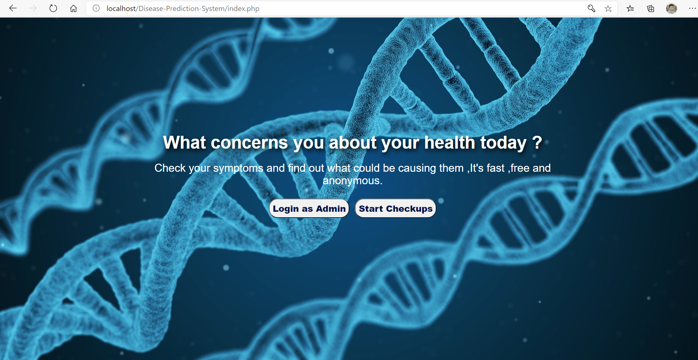
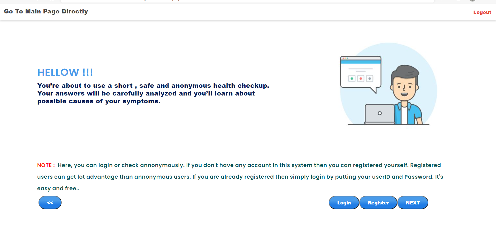
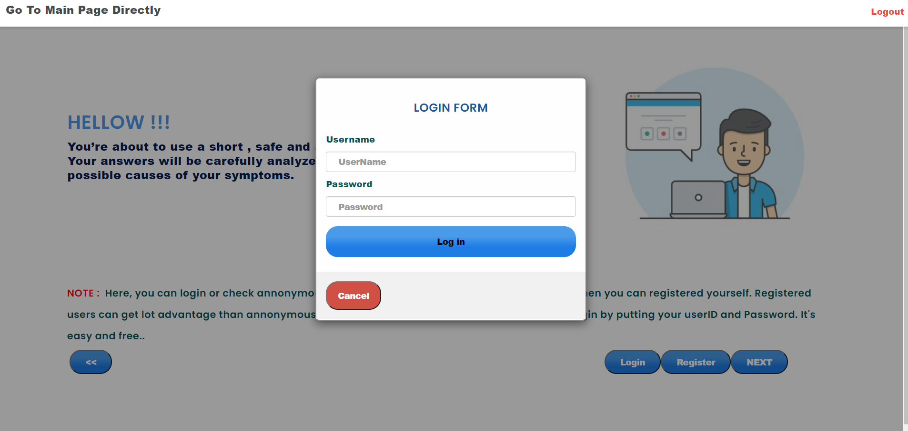
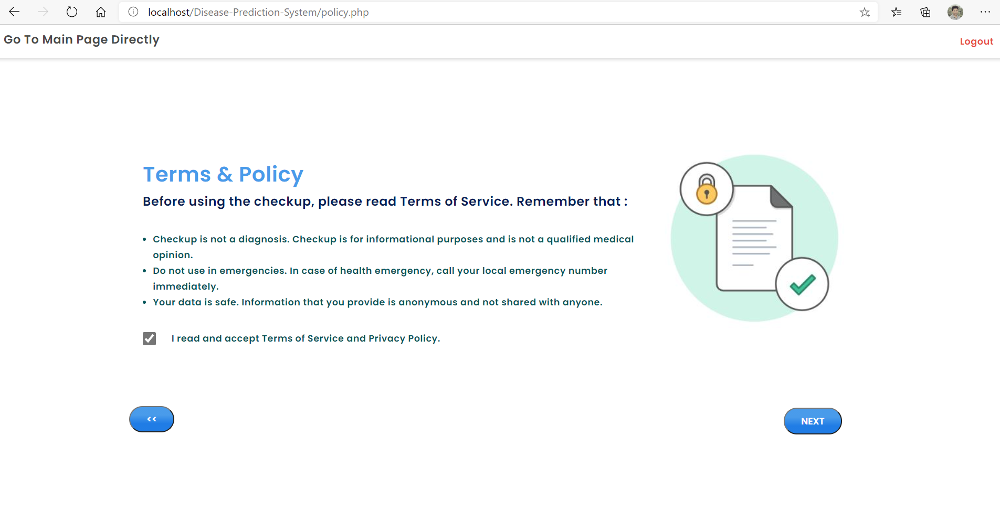
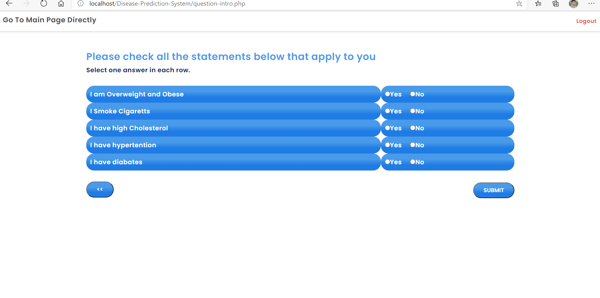
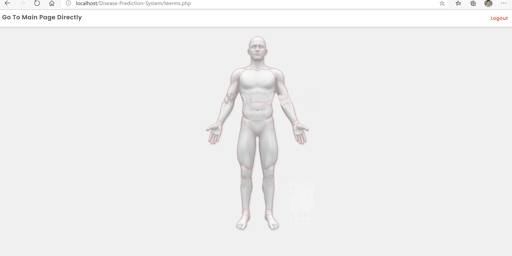
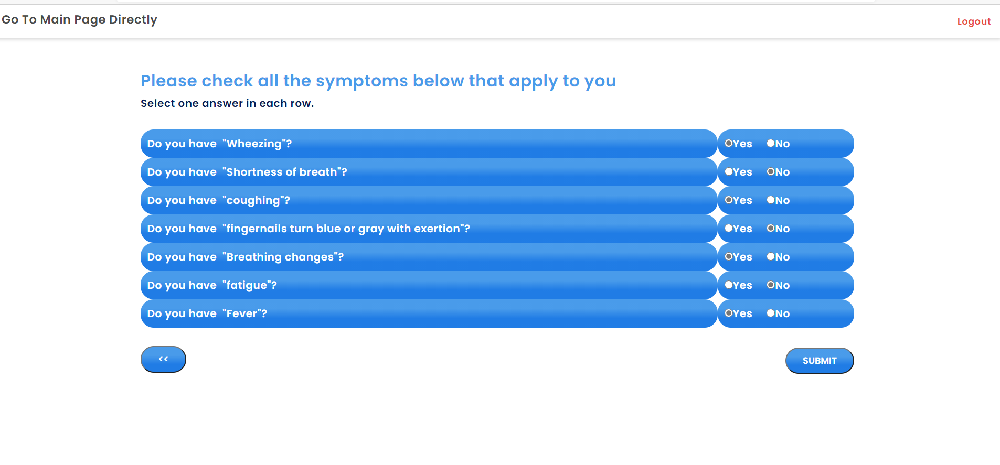
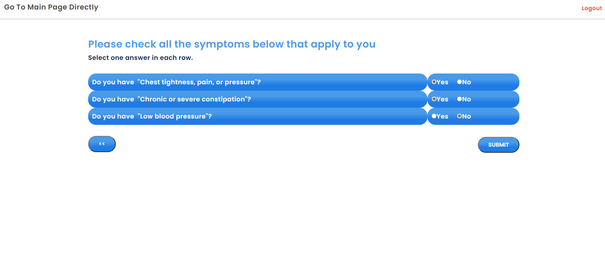
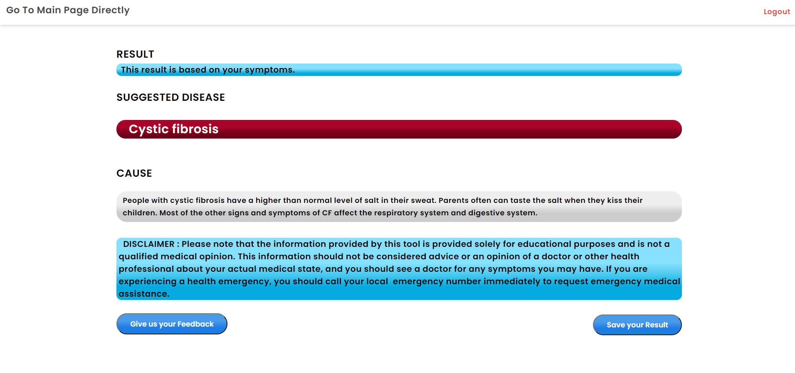
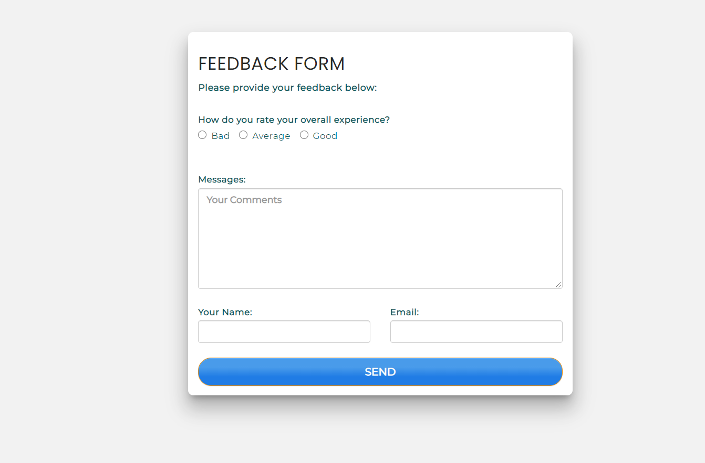

# Disease-Prediction-System
This Project is predict the disease based on your Symptoms .Here ,the I use Html, CSS, JavaScript ,PHP ,MySql ,JQuery. .Before Enter to the project at first insert the database into the sql database .Database file is given inside the project.

## Here, I am trying to do this project using core php .
##### This project had been done for the requirements Software Engineering Courses which is done in 01-01-2020  to 31-04-2020.

###### For log in or you can Registration 

For Admin Login UserName: admin 
                Password: Ab123456

For User Login UserName: user
               Password:Ab123456

###### Note: This Project is Not fully Responsive 

#### Some Samples of this project is given below :

